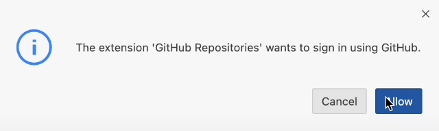
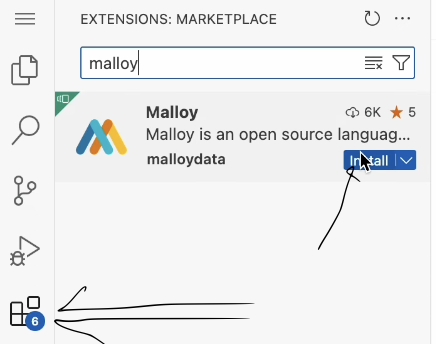
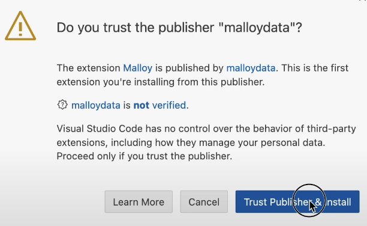
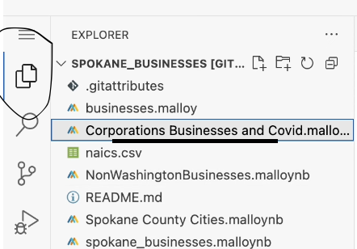
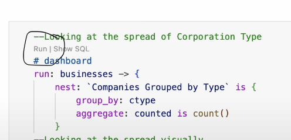

# TSA Traveler Complaints Dataset

## Overview

This dataset contains monthly counts of traveler complaints filed with the Transportation Security Administration (TSA) across various airports. Complaints are categorized by airport, category, and subcategory, providing insights into traveler experiences and recurring issues over time.

## Importance of the Data

This data is crucial for understanding the effectiveness and efficiency of TSA operations across different airports. Policymakers and stakeholders can identify systemic issues, improve security screening processes, and enhance traveler satisfaction by analyzing complaint patterns. Additionally, it promotes transparency and accountability within the TSA, helping to ensure that traveler concerns are addressed and service standards are maintained.Improving the overall airport and security experience and providing insights that can help shape better practices, procedures, and policies. Such as: 

### 1. Improves Customer Service
   - Identifies recurring issues that affect passenger satisfaction.
   - Helps the TSA enhance service quality, leading to smoother travel experiences.

### 2. Identifies Trends and Patterns
   - Highlights common problems, such as long wait times or inefficient screenings.
   - Provides the TSA with actionable insights for targeted improvements.

### 3. Enhances Security Procedures
   - Allows the TSA to refine security processes while ensuring they remain effective.
   - Balances the need for robust security with minimizing delays and inconvenience for passengers.

### 4. Ensures Accountability and Transparency
   - Promotes trust by allowing passengers to hold the TSA accountable for their actions.
   - Transparent reporting and addressing of complaints help maintain public confidence.

By analyzing TSA complaint data, the agency can continuously improve both security and customer service, making air travel safer and more efficient for everyone.

## Data Source

The data is collected and maintained by the Transportation Security Administration (TSA). Each record represents the total number of complaints received for a specific airport, category, and subcategory within a given month. In its FOIA Electronic Reading Room, the TSA publishes semi-regular reports on the monthly numbers of traveler complaints by airport, category, and subcategory. The data can be accessed from the TSA FOIA Electronic Reading Room at [tsa.gov/foia/readingroom](https://www.tsa.gov/foia/readingroom?page=0).

The Data Liberation Project has cleaned and converted the data from PDF format into a more accessible CSV format, making it easier for analysis and research.[tsa-complaint-counts](https://www.data-liberation-project.org/datasets/tsa-complaint-counts/).

## Malloy Code Files


This repository contains two Malloy code files:

- [complaints.malloynb](https://github.com/nmonareng/TSA-Complaints/blob/main/complaints.malloynb)


## Summary of Findings

The results provide an overview of the analyzed complaints; however, they may not be fully comprehensive. Unfortunately, some complaints have not been allocated to an airport, category, or subcategory due to missing or incomplete data. As a result, certain insights may be limited, and the findings should be interpreted with this consideration in mind.

Using Malloy, a summary of complaints by country has been generated and this is the code:

```
SubCategory_Complaints -> {
    group_by: Airport_code.country_name
    aggregate: total_complaints
    # percent
    all_complaints is total_complaints / all(total_complaints)
}
```

This calculation helps analyze the proportion of total complaints attributed to different countries, providing insights into geographic trends in traveler concerns.

### Visualization

Below is an image showcasing the results of the code in Malloy:


# How to Open a Shared GitHub File and Run Malloy Code
To explore the data and run the analyses:

## 1. Open the Shared GitHub File 

Click on the https://github.com/nmonareng/TSA-Complaints provided to access the shared repository or file. 

Once on Github, click Shift + period this will load the web editor. Then install the malloy extension. See images below for reference:
| **Step**   | **Image Preview** |
|--------|-----------|
| `Step 1 - Press allow` |  |
| `Step 2 - Click the Blocks, search for Malloy, install` |  |
| `Step 3 - Click Trust` |  |
| `Step 4 - Click a .malloynb file` |  |
| `Step 5 - Press Run` |  |


Navigate to file complaints.malloynb to run the code. 

### Install Dependencies: 

Ensure you have the necessary tools to run .malloynb notebooks. Malloy is a data modeling language; you'll need the appropriate environment to execute these notebooks.

Run the Notebooks: Open and run the .malloynb notebooks using your preferred environment to reproduce the analyses.

If using VS Code, install the Malloy plugin.

## License

This dataset is provided for educational and research purposes. Please cite the TSA as the original data source if used in publications or projects. The Github data files and codes have been generated by Nobuhle Lisa Monareng for Gonzaga University Graduate School of Business as part of the MSBA-622-01 Data Science for Business (Spring 2025) course. 
Additional information and access to the cleaned dataset can be found at the Data Liberation Project: [tsa-complaint-counts](https://www.data-liberation-project.org/datasets/tsa-complaint-counts/).

## Contact

For questions or more information, please contact the TSA at [tsa.gov](https://www.tsa.gov/).

